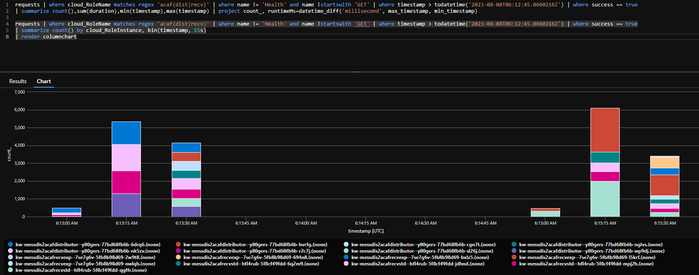

# Message Distribution

> !!! THIS IS A DISCONNECTED BRANCH THAT CANNOT BE MERGED !!!

With this repository I want to evaluate and performance test various asynchronous message distribution options with **Azure** resources and hosting platforms. Focus is on measuring the end-to-end **throughput** regardless whether or not certain platform constellations scale or not.

Currently hosted only Azure Container Apps (ACA) is implemented in this repo

| code used for solution elements | implementation and deployment approach                                                                                             |
| ------------------------------- | ---------------------------------------------------------------------------------------------------------------------------------- |
| **ACAF**                        | .NET [Azure Functions on ACA deployment](https://learn.microsoft.com/en-us/azure/azure-functions/functions-container-apps-hosting) |
| **DAPR**                        | ASP.NET with Dapr in a plain container on ACA                                                                                      |
| **FUNC**                        | .NET Azure Functions as plain container on ACA                                                                                     |

For pub/sub both variants - Azure Service Bus Queues and Topics are to be tested - designated by the suffix **Q** or **T**. Currently only the queues track is completely implemented and tested. Hence only tests with these codes can be started:

- **ACAFQ**
- **DAPRQ**
- **FUNCQ**

## Approach

- a Function App generates a test data payload (e.g. with 10k orders) and puts those in a blob storage
- this Function App is then be triggered to schedule all orders at one time on an ingress Service Bus queue - either for Functions or for Dapr


## TL;DR conclusion

To run a sequence of tests I used `scripts/cli/loop.sh` renders troughput results into this [log file](./LOG.md).

As of 2023-08-08 (and with only 10k orders, with no heavy logic) there is no significant


What is strange and can be observed consistantly is, that Functions in Containers scale as expected (up then down)


and [Functions on ACA show this gap](https://github.com/Azure/azure-functions-on-container-apps/issues/33) in processing



It seems that the 2 receiver Functions pick up traffic from the queue with a delay - or are scaled up with a delay.

---

## environment creation

### with az/Azure CLI

> as of Aug'23 some of constellations of Functions on Azure Container Apps where not working, I created an alternate slate of **Azure CLI** based script to deploy the same set of **Bicep** templates, as used with **azd**

script path: `{repo-root}/scripts/cli/`

create an `.env` file in root of this repository to control environment name and location (subscription is determined by subscription set with **azd**):

```
AZURE_ENV_NAME="my-messdist"
AZURE_LOCATION="westus"
```

and then

```shell
az login --use-device-code
./scripts/cli/deploy-infra.sh
./scripts/cli/deploy-apps.sh build
```

### with azd/Azure Developer CLI

**Azure Developer CLI** is used to create the environment:

- install
- initialize - select region and subscription
- deploy environment
- create local (and application) settings files for local debugging
- create local secrets files
- generate a test data set to be used for performance tests into Azure Storage

script path: `{repo-root}/scripts/azd/`

```shell
azd login --use-device-code
az login --use-device-code
azd init
azd up
./scripts/azd/create-local-settings.sh
./scripts/azd/create-secrets.sh
```

## run test

> `{deployment}` refers to either `azd`=**azd** or `cli`=**az** deployment - see above

```shell
./scripts/{deployment}/generate-test-data.sh
```

then either push test data into the Dapr or Functions application scenario (in this sample the q=queue scenarios):

```shell
./scripts/{deployment}/push-ingress.sh daprq
```

or

```shell
./scripts/{deployment}/push-ingress.sh funcq
```

or

```shell
./scripts/{deployment}/push-ingress.sh acafq
```

> persisted [test results](./LOG.md)

---

## Observations

These queries - especially the 2nd one - where used to measure end-to-end throughput (from time of first message activated to time last message processed):

### get telemetry results

#### DAPR=Dapr

```
requests
| where timestamp > todatetime('2022-11-03T07:09:26.9394443Z')
| where name startswith "POST" and cloud_RoleName matches regex "^[\\d\\w\\-]+dapr"
| where success == true
| summarize count() by cloud_RoleInstance, bin(timestamp, 15s)
| render columnchart

requests
| where timestamp > todatetime('2022-11-03T07:09:26.9394443Z')
| where name startswith "POST" and cloud_RoleName matches regex "^[\\d\\w\\-]+dapr"
| where success == true
| summarize count(),sum(duration),min(timestamp),max(timestamp)
| extend runtimeMs=datetime_diff('millisecond', max_timestamp, min_timestamp)
```

```
"count_","sum_duration","min_timestamp [UTC]","max_timestamp [UTC]",runtimeMs
20000,"397686.0827000005","5/13/2023, 5:42:41.564 PM","5/13/2023, 5:43:10.280 PM",28716
```

#### FUNC=(plain) Functions containers on Container Apps

```
requests
| where cloud_RoleName startswith "func"
| where name != "Health"
| where timestamp > todatetime('2022-11-03T07:09:26.9394443Z')
| where success == true
| summarize count() by cloud_RoleInstance, bin(timestamp, 15s)
| render columnchart

requests
| where cloud_RoleName startswith "func"
| where name != "Health"
| where timestamp > todatetime('2022-11-03T07:09:26.9394443Z')
| where success == true
| summarize count(),sum(duration),min(timestamp),max(timestamp)
| extend runtimeMs=datetime_diff('millisecond', max_timestamp, min_timestamp)
```

```
"count_","sum_duration","min_timestamp [UTC]","max_timestamp [UTC]",runtimeMs
20000,"3599606.129400003","5/13/2023, 5:47:45.643 PM","5/13/2023, 5:49:07.432 PM",81789
```

#### ACAF=Functions on Container Apps

```
requests
| where cloud_RoleName matches regex "acaf"
| where name != "Health"
| where timestamp > todatetime('2023-08-06T13:18:27.0499471Z')
| where success == true
| summarize count() by cloud_RoleInstance, bin(timestamp, 15s)
| render columnchart

requests
| where cloud_RoleName matches regex "acaf"
| where name != "Health"
| where timestamp > todatetime('2023-08-06T13:18:27.0499471Z')
| where success == true
| summarize count(),sum(duration),min(timestamp),max(timestamp)
| extend runtimeMs=datetime_diff('millisecond', max_timestamp, min_timestamp)
```

```
"count_","sum_duration","min_timestamp [UTC]","max_timestamp [UTC]",runtimeMs
19860,"2314818.319500003","27.5.2023, 14:34:38.222","27.5.2023, 14:36:05.652",87430
```

> in that test run not all records processed are logged

### Dapr batching

Dapr input binding and pub/sub Service Bus components need to be set to values much higher than [the defaults](https://docs.dapr.io/reference/components-reference/supported-bindings/servicebusqueues/) to get a processing time better than Functions - keeping defaults shows Dapr E2E processing time almost factor 2 compared to Functions.

```
        {
          name: 'maxActiveMessages'
          value: '1000'
        }
        {
          name: 'maxConcurrentHandlers'
          value: '8'
        }
```

### Functions batching

Changing from single message dispatching to batched message dispatching and thus using batching `"MaxMessageBatchSize": 1000` did not have a positive effect - on the contrary: processing time was 10-20% longer.

_single message dispatching_

```csharp
        [FunctionName("Dispatch")]
        public void Run(
            [ServiceBusTrigger("q-order-ingress-func", Connection = "SERVICEBUS_CONNECTION")] string ingressMessage,
            [ServiceBus("q-order-express  {
    name: 'WEBSITE_SITE_NAME'
    value: appName
  }
ollector<ServiceBusMessage> outputExpressMessages,
            [ServiceBus("q-order-standard-func", Connection = "SERVICEBUS_CONNECTION")] ICollector<ServiceBusMessage> outputStandardMessages,
            ILogger log)
        {
            ArgumentNullException.ThrowIfNull(ingressMessage,nameof(ingressMessage));

            var order = JsonSerializer.Deserialize<Order>(ingressMessage);

            ArgumentNullException.ThrowIfNull(order,nameof(ingressMessage));
```

_batched_

```csharp
        [FunctionName("Dispatch")]
        public void Run(
            [ServiceBusTrigger("q-order-ingress-func", Connection = "SERVICEBUS_CONNECTION")] ServiceBusReceivedMessage[] ingressMessages,
            [ServiceBus("q-order-express-func", Connection = "SERVICEBUS_CONNECTION")] ICollector<ServiceBusMessage> outputExpressMessages,
            [ServiceBus("q-order-standard-func", Connection = "SERVICEBUS_CONNECTION")] ICollector<ServiceBusMessage> outputStandardMessages,
            ILogger log)-func", Connection = "SERVICEBUS_CONNECTION")] IC
        {
            foreach (var ingressMessage in ingressMessages)
            {
                var order = JsonSerializer.Deserialize<Order>(Encoding.UTF8.GetString(ingressMessage.Body));
                ArgumentNullException.ThrowIfNull(order, nameof(ingressMessage));
```

## Error Situtations

At a point I had a suspicous error which I could not make sense of:

```
ERROR: failed packaging service 'acafdistributor': failing invoking action 'package', tagging image: tagging image: exit code: 1, stdout: , stderr: Error parsing reference: "message-distribution/acafdistributor-:azd-deploy-1696684259" is not a valid repository/tag: invalid reference format
```

It turned out I accidentally removed `AZURE_ENV_NAME` from my environment configuration in `.azure/kw-messdist/.env`:

```
AZURE_ENV_NAME="kw-messdist"
AZURE_LOCATION="westeurope"
AZURE_SUBSCRIPTION_ID="00000000-0000-0000-0000-000000000000"
```

{"Entries":null,"Topic":null,"Metadata":null}
{"Entries":[{"EntryId":"7182fb3e-6541-4632-8872-e238d48b9a27","ContentType":"application/cloudevents\u002Bjson","Metadata":{"metadata.ContentType":"application/json","metadata.DeliveryCount":"1","metadata.EnqueuedTimeUtc":"Wed, 01 Nov 2023 09:42:12 GMT","metadata.LockToken":"TQQUPDTFSTOxMInvypvxXw==","metadata.LockedUntilUtc":"Wed, 01 Nov 2023 09:43:12 GMT","metadata.MessageId":"28cdf2d9-6c70-40cd-6745-94909e9f3285","metadata.SequenceNumber":"13"},"Event":{"Id":"06a67be1-9f62-4e7d-baf8-c8305f8e5c13","Source":"testdata","Type":"com.dapr.event.sent","Specversion":"1.0","Datacontenttype":"application/json","Data":{"OrderId":1000000,"OrderGuid":"93de68a3-7361-479c-a39f-fe3ce1533950","Description":"l74ss3x3rp67twzysbn0qftxatxqqyhbfd6sr768","FirstName":"Billy","LastName":"Greenholt","Delivery":"Standard","Items":[{"OrderItemId":1,"SKU":"9590-7593-9632","Quantity":6},{"OrderItemId":2,"SKU":"7589-1999-7236","Quantity":4},{"OrderItemId":3,"SKU":"7105-3608-3124","Quantity":3},{"OrderItemId":4,"SKU":"8293-6676-2502","Quantity":9},{"OrderItemId":5,"SKU":"3731-7221-1001","Quantity":10}]}}},{"EntryId":"d3fa0dd3-57cc-4745-8ac7-a7f38616d6dd","ContentType":"application/cloudevents\u002Bjson","Metadata":{"metadata.ContentType":"application/json","metadata.DeliveryCount":"1","metadata.EnqueuedTimeUtc":"Wed, 01 Nov 2023 09:42:12 GMT","metadata.LockToken":"YpkN6H7\u002BREKz6wrYvtLUhg==","metadata.LockedUntilUtc":"Wed, 01 Nov 2023 09:43:12 GMT","metadata.MessageId":"d10a949d-d66a-4dd2-55b1-5f30a472c373","metadata.SequenceNumber":"14"},"Event":{"Id":"77e1ae04-9099-469b-8c0b-fdcc7a9684ee","Source":"testdata","Type":"com.dapr.event.sent","Specversion":"1.0","Datacontenttype":"application/json","Data":{"OrderId":1000001,"OrderGuid":"d19d55d8-825c-4498-b14e-dcfad1dcbd67","Description":"phhiaftumbxxynyfugf8gkx8l6q83ht7h24wbkax","FirstName":"Gudrun","LastName":"Nikolaus","Delivery":"Express","Items":[{"OrderItemId":1,"SKU":"7044-1912-5176","Quantity":3},{"OrderItemId":2,"SKU":"4236-9142-7557","Quantity":7},{"OrderItemId":3,"SKU":"7318-3275-5980","Quantity":6},{"OrderItemId":4,"SKU":"3055-7117-9606","Quantity":7},{"OrderItemId":5,"SKU":"7507-9142-1852","Quantity":8},{"OrderItemId":6,"SKU":"3595-9722-0514","Quantity":7}]}}}],"Topic":"t-order-ingress-dapr-bulk","Metadata":{"pubsubName":"order-pubsub"}}

Exception while executing function: PushIngressDaprT Bulk Publish operation failed: the Dapr endpoint indicated a failure. See InnerException for details. Status(StatusCode="ResourceExhausted", Detail="grpc: received message larger than max (5297965 vs. 4194304)")
